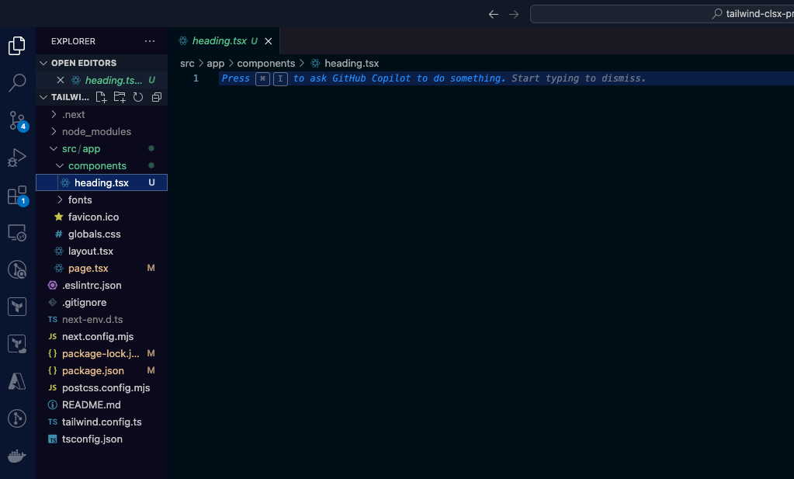
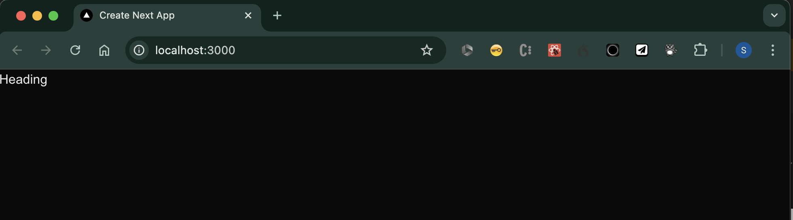
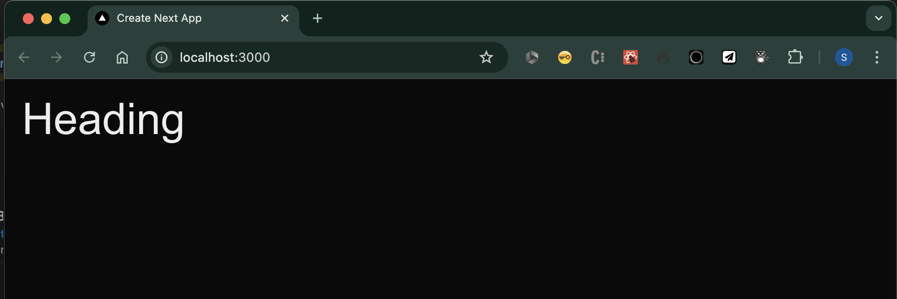
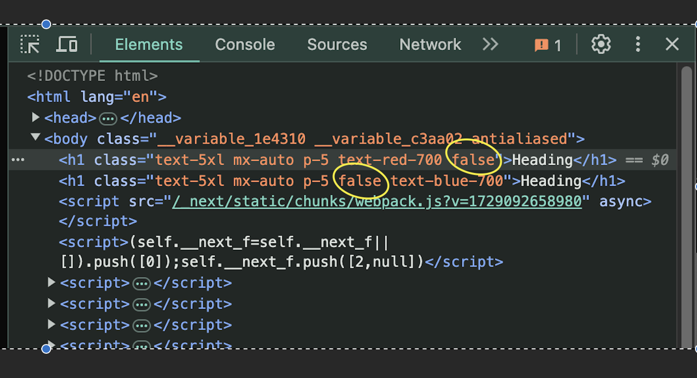
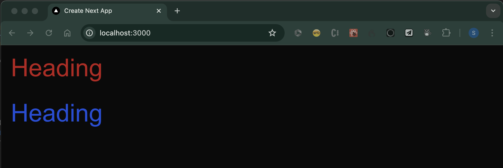
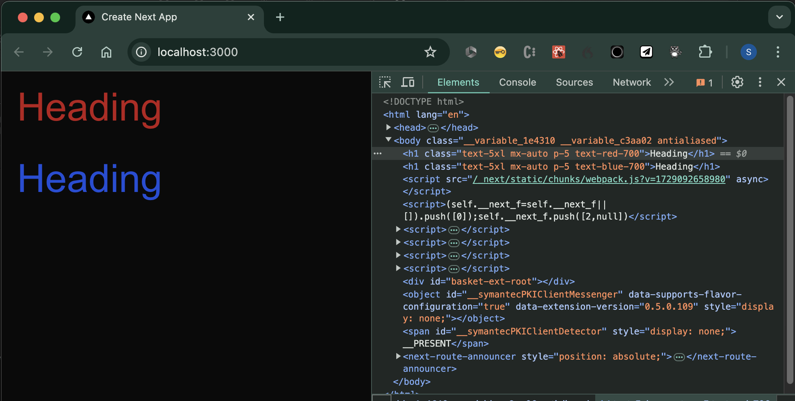

## Overview

[clsx](https://www.npmjs.com/package/clsx), the lightweight library generally used to simplify the use of conditional CSS class names in libraries such as React, is something I am pretty new to.

Like a lot of these small, convenience tools, its great to have in your toolchain, but sometimes the set up is a little time consuming. Thats where I hope this article can help.

I am using clsx with tailwind at the moment, and its a must that my team are using tailwind in a consistent way. I have always reached for tools such as eslint and prettier to ensure our codebase stays as consistent as possible and so I was keen to make sure that, if we use clsx, we don't lose that consistency. This is where the prettier-plugin-tailwindcss plugin for prettier comes in.

This [reference repo](https://github.com/speaktosteve/tailwind-clsx-prettier) explains how we set up our toolchain

-   a basic Next.js app with tailwind
-   clsx
-   prettier
-   the prettier-plugin-tailwindcss plugin

---

## Setup

The setup is simple, create a basic Next.js app -> https://nextjs.org/docs/getting-started/installation

```bash
npx create-next-app@latest
```

Choosing the defaults (TypeScript, ESLint, Tailwind CSS)

<a href="./public/post-assets/1.png" target="_blank">

</a>

Create a simple component 'heading', running the following from the root of the new project folder:

```bash
mkdir -p src/app/components && cd $_ && touch heading.tsx
```

This should create a blank 'heading.tsx' file in a new src/app/components folder:

<a href="./public/post-assets/2.png" target="_blank">

</a>

Lets create a simple component in that file:

```ts
export const Heading = () => {
    return <h1>Heading</h1>;
}
```

And reference the component from the src/app/page.tsx file:

```ts
import { Heading } from "./components/heading";

export default function Home() {
  return (
    <Heading />
  );
}
```

If you run the site:

```bash
npm run dev
```

And view the site in your browser (usually at http://localhost:3000), you should something like this:

<a href="./public/post-assets/3.png" target="_blank">

</a>

Lets add a couple of Tailwind classes, make this pretty:

```ts
export const Heading = () => {
    return <h1 className="text-5xl mx-auto p-5">Heading</h1>;
}
```

<a href="./public/post-assets/4.png" target="_blank">

</a>

Next, we are going to add a property to our heading component, so we can flip the colour of the text from a parent component

```ts
export const Heading = ({textColour}:{textColour: 'red'|'blue'}) => {
    return <h1 className={`text-5xl mx-auto p-5 ${textColour === 'red' ? 'text-red-700' : textColour === 'blue' ? 'text-blue-700' : ''}`}>Heading</h1>;
}
```

<div class="border p-4 not-italic">
<strong>Side Note</strong>

An alternative approach is to use [the logical && operator](https://legacy.reactjs.org/docs/conditional-rendering.html#inline-if-with-logical--operator).
This results, in this simple example, as something resembling our clsx example that you can see later in this article:

```ts
className={`text-5xl mx-auto p-5 ${textColour === 'red' && 'text-red-700'}
  ${textColour === 'blue' && 'text-blue-700'}`}
```

The benefit is you dont have the annoying `' : ''` OR statement with the empty string that we see in the ternary expression. However, this results in your generated markup being littered with useless 'false' statements in your class list (which wont happen if you use clsx):

<a href="./public/post-assets/6.png" target="_blank">

</a>

</div>

Standard stuff so far right? We have a component that can take property that is used to conditionally set the text colour, between red and blue.

Lets update the page.tsx and see it in action:

```ts
import { Heading } from "./components/heading";

export default function Home() {
  return (
    <>
      <Heading textColour="red" />
      <Heading textColour="blue" />
    </>
  );
}
```

Beautiful right?

<a href="./public/post-assets/5.png" target="_blank">

</a>

## Adding clsx

Now the good bit, as you can see above, we are using a standard ternary expression to apply the desired tailwind class:

```ts
className={`text-5xl mx-auto p-5 ${textColour === 'red' ? 'text-red-700' :
    textColour === 'blue' ? 'text-blue-700' : ''}`}
```

We're going to leverage clsx to tidy this expression up a bit.

Lets install [clsx](https://www.npmjs.com/package/clsx)

```bash
npm install --save clsx
```

Then update our 'heading.tsx' component:

```ts
import {clsx} from 'clsx';

export const Heading = ({textColour}:{textColour: 'red'|'blue'}) => {
    return <h1 className={clsx(
        'text-5xl mx-auto p-5',
        textColour === 'red' && 'text-red-700',
        textColour === 'blue' && 'text-blue-700'
      )}>Heading</h1>;
}
```

Nice, the component still renders as before, but its cleaner and (in my mind) easier to read. There is no annoying `' : ''` empty OR bit and the resulting markup is clean (no 'false' strings being added):

<a href="./public/post-assets/7.png" target="_blank">

</a>

## Setting up the prettier-plugin-tailwindcss

If you followed the instructions in this article from the beginning then the `npx create-next-app@latest` command will have set up tailwind for you. If not, then you can add tailwind using the following commands to install and configure:

```bash
npm install -D tailwindcss postcss autoprefixer
npx tailwindcss init -p
```

To set up VS Code to integrate prettier with the built-in formatter, follow these instructions: https://marketplace.visualstudio.com/items?itemName=esbenp.prettier-vscode

Now, lets install prettier and the prettier plugin for tailwind:

```bash
npm install -D prettier prettier-plugin-tailwindcss
```

And create the pretter config file on the root of your project folder:

```bash
touch .prettierrc
```

I'm going to start with the basic configuration:

```json
{
    "trailingComma": "es5",
    "tabWidth": 4,
    "semi": false,
    "singleQuote": true
}
```

And then add a reference to the tailwind plugin that we just installed:

```json
{
    "trailingComma": "es5",
    "tabWidth": 4,
    "semi": false,
    "singleQuote": true,
    "plugins": ["prettier-plugin-tailwindcss"]
}
```

If you now save a file that contains tailwind class references you should see them being re-ordered as per the [recommended class order](https://tailwindcss.com/blog/automatic-class-sorting-with-prettier#how-classes-are-sorted).

Before:

```tsx
<div class="pt-2 p-4">
  <!-- ... -->
</div>
```

After saving (or explicitly running the 'format document' command):

```tsx
<div class="p-4 pt-2">
  <!-- ... -->
</div>
```

## Supporting clsx

In order for prettier to sort classes that are part of a clsx method call (and not in a className attribute) there is a further step.

Consider this improvement on the clsx example above:

```tsx
import { clsx } from 'clsx'

export const Heading = ({ textColour }: { textColour: 'red' | 'blue' }) => {
    const classes = clsx(
        'mx-auto p-5 pt-5 text-5xl',
        textColour === 'red' && 'text-red-700',
        textColour === 'blue' && 'text-blue-700'
    )
    return <h1 className={classes}>Heading</h1>
}
```

The formatter wont pick up the tailwind classes that are part of the call to the cslx method in the 'classes' variable.

All we need to do is add the following line to our prettier config:

```json
"tailwindFunctions": ["clsx"]
```

So the full file looks like this:

```json
{
    "trailingComma": "es5",
    "tabWidth": 4,
    "semi": false,
    "singleQuote": true,
    "tailwindFunctions": ["clsx"],
    "plugins": ["prettier-plugin-tailwindcss"]
}
```

Now, after saving (or explicitly running the 'format document' command), you will see the classes have been sorted:

```tsx
import { clsx } from 'clsx'

export const Heading = ({ textColour }: { textColour: 'red' | 'blue' }) => {
    const classes = clsx(
        'mx-auto p-5 pt-5 text-5xl',
        textColour === 'red' && 'text-red-700',
        textColour === 'blue' && 'text-blue-700'
    )
    return <h1 className={classes}>Heading</h1>
}
```

See [Sorting classes in function calls](https://github.com/tailwindlabs/prettier-plugin-tailwindcss?tab=readme-ov-file#sorting-classes-in-function-calls) part of the extension's docs for a full reference.
